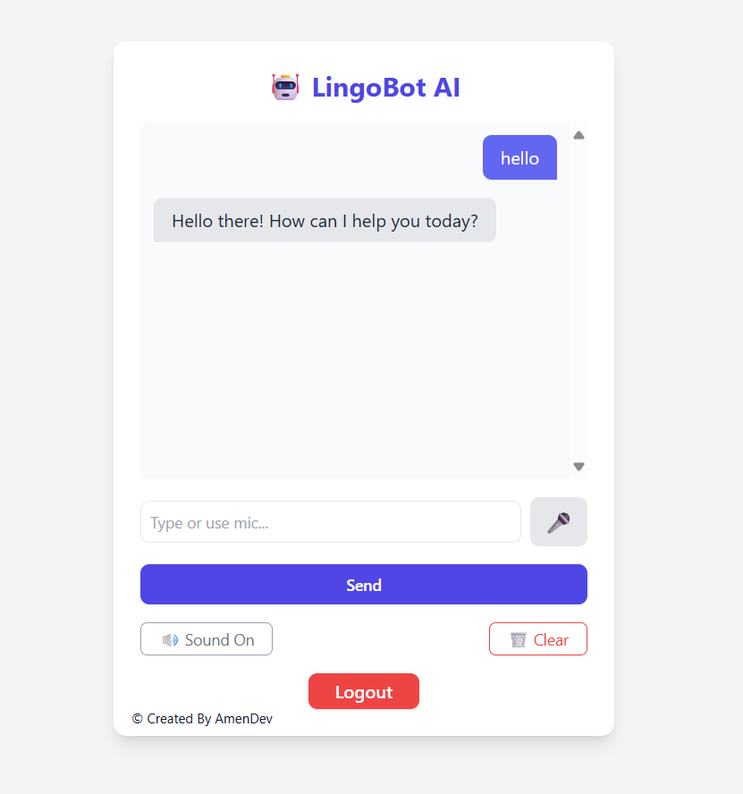

# LingoBot-AI
LingoBot AI is an intelligent chatbot designed to be a helpful assistant across various domains, including languages, programming, and general knowledge 🧠. It leverages the power of the Gemini 1.5 Flash model through the OpenRouter API to provide smart and relevant responses.

# Key features of LingoBot AI include:

# User Authentication 🔐: 
Users can securely log in to the application. The system ensures that only authenticated users can access the chat interface, redirecting unauthenticated users to the login page.

# Real-time Chat Interface 💬: 
LingoBot offers a clean and intuitive chat interface where users can interact with the AI. User and bot messages are clearly distinguished and displayed in a scrollable chatbox.

# Speech-to-Text Input 🎤:
For convenience, users can input their queries using their voice through the integrated speech recognition feature, making interactions more natural.

# Text-to-Speech Output 🔊: 
The bot's responses can be read aloud, providing an auditory experience. This feature can be toggled on or off by the user.

# Chat History Management:
Messages exchanged during a session are saved to a Firebase Firestore database, ensuring that conversations are persistent. Users also have the option to clear the current chat history.

# Logout Functionality ➡️🚪:
Users can securely log out of their session, which also clears their local user ID.

# Responsive Design 📱💻:
The interface is designed to be responsive, adapting to different screen sizes.
